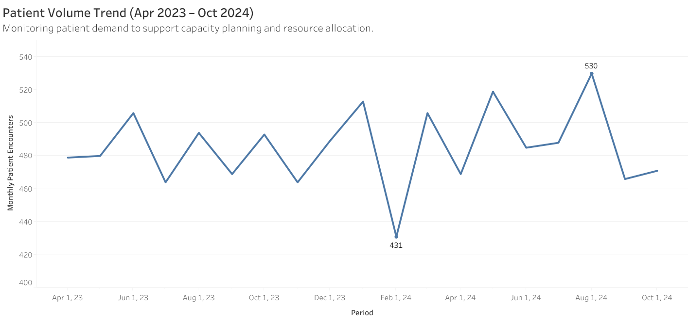
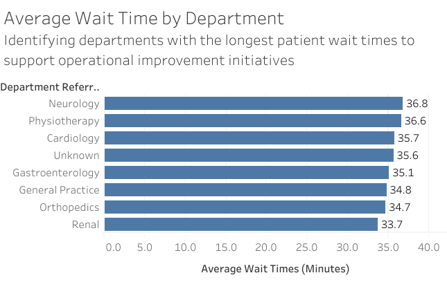
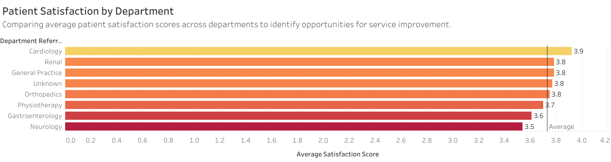

# Healthcare Operations Intelligence
https://public.tableau.com/authoring/HealthcareOperationsDashboard_17810307133930/Dashboard1#1

## 📌 Project Overview

Healthcare organizations generate large volumes of operational data every day. Transforming that data into actionable insights is critical for improving patient access, resource utilization, and overall performance.

This project analyzes healthcare operations data to identify trends in patient volume, appointment demand, wait times, staffing utilization, and patient satisfaction. Using SQL and Tableau, the analysis uncovers operational challenges and provides data-driven recommendations to support decision-making and improve the patient experience.

---

## 🎯 Business Objectives

This project was designed to answer the following operational questions:

* How has patient volume changed over time?
* Which departments experience the longest wait times?
* When are peak patient arrival hours occurring?
* How effectively are staffing resources aligned with demand?
* Which departments have the highest and lowest patient satisfaction scores?

---

## 🛠️ Tools & Technologies

* **SQL** – Data extraction, cleaning, and analysis
* **Tableau** – Dashboard development and visualization
* **Excel** – Data validation and exploratory analysis
* **Healthcare Operations Analytics** – KPI monitoring and performance analysis

---

## 📊 Key Performance Indicators (KPIs)

* Patient Volume Trends
* Average Wait Time by Department
* Peak Arrival Hours
* Resource Utilization
* Patient Satisfaction Scores

---

## 🔎 Analytical Approach

### 1. Data Preparation

* Reviewed and validated healthcare operational datasets
* Standardized fields and verified data quality
* Prepared datasets for analysis and visualization

### 2. Exploratory Analysis

* Evaluated patient demand patterns over time
* Identified high-volume periods and operational bottlenecks
* Compared departmental performance metrics

### 3. Dashboard Development

Created interactive Tableau visualizations to support operational decision-making:

* Patient Volume Trend Analysis
* Average Wait Time by Department
* Peak Arrival Hours
* Resource Utilization Dashboard
* Patient Satisfaction Analysis

---

## 📈 Key Insights

### Patient Demand Patterns

Patient volume fluctuates throughout the year, highlighting the importance of proactive staffing and scheduling strategies.

### Wait Time Performance

Certain departments consistently experience longer wait times, indicating opportunities for workflow optimization and resource reallocation.

### Peak Arrival Hours

Patient arrivals are concentrated during specific periods of the day, creating predictable demand surges that can inform staffing decisions.

### Resource Utilization

Operational performance improves when staffing levels are aligned with patient demand patterns.

### Patient Experience

Patient satisfaction varies by department, suggesting targeted improvement opportunities in service delivery and patient engagement.

---

## 💡 Business Recommendations

* Adjust staffing schedules to align with peak patient arrival periods.
* Monitor high-wait-time departments and investigate workflow bottlenecks.
* Develop department-specific improvement plans for patient satisfaction.
* Implement ongoing KPI monitoring through interactive dashboards.
* Leverage operational analytics to support data-driven resource planning.

---

## 📸 Dashboard Preview

*(Insert Tableau dashboard screenshots here)*

### Patient Volume Trends

### Wait Time Analysis

### Patient Satisfaction

---

## 🚀 Future Enhancements

* Predictive forecasting for patient demand
* Staffing optimization modeling
* Real-time KPI monitoring
* Additional patient access and scheduling metrics

---

## 👩‍💻 Author

**Mary Kane**

Operations & Data Analyst

Bilingual (English–Spanish)

🔗 GitHub: https://github.com/mkane00

🔗 Tableau Public: https://public.tableau.com/authoring/HealthcareOperationsDashboard_17810307133930/Dashboard1#1

